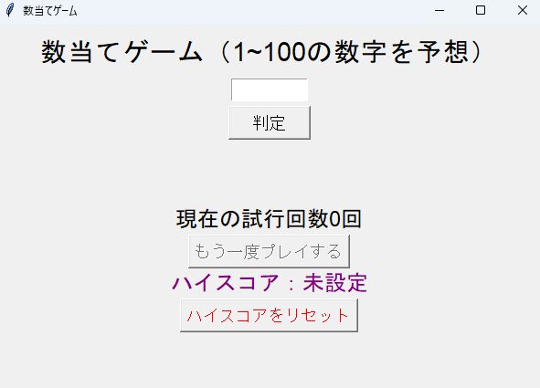

# number-guessing-game

# 数当てゲーム（Python / Tkinter）

## 概要
PythonとTkinterを使用して作成したGUIアプリケーションです。1～100のランダムな数字をユーザーが予想し、正解を目指します。試行回数を記録し、ハイスコア（最少回数）も管理されます。

## 特徴
- GUIによる直感的なインターフェース
- 試行回数のカウントと表示
- ハイスコアの記録とリセット機能
- キーボードのEnterキーによる操作対応

## 使用技術
- Python 3.11.9
- Tkinter（標準ライブラリ）

## スクリーンショット


## 実行方法
Pythonがインストールされていれば、以下のコマンドで実行できます：

```bash
python main.py
